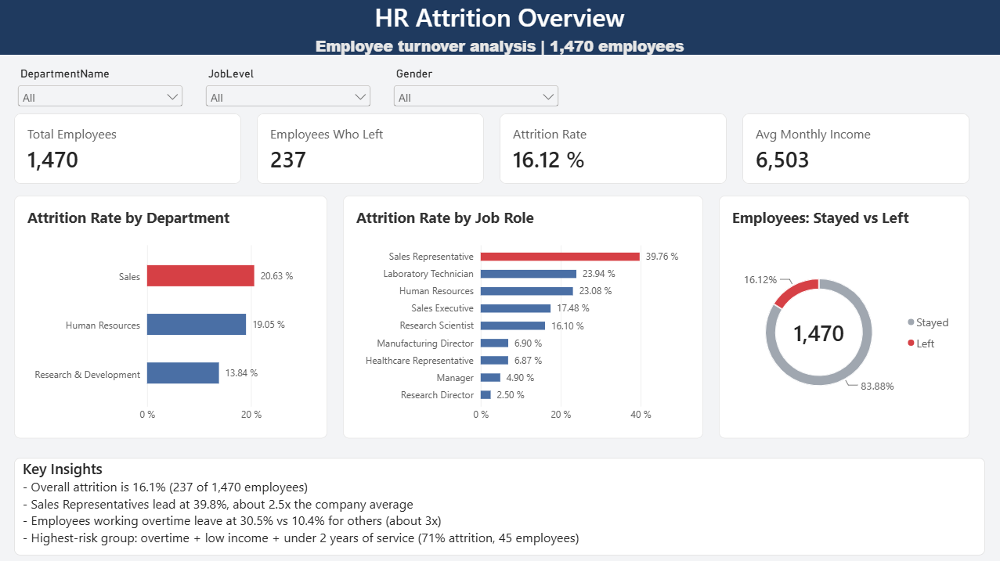
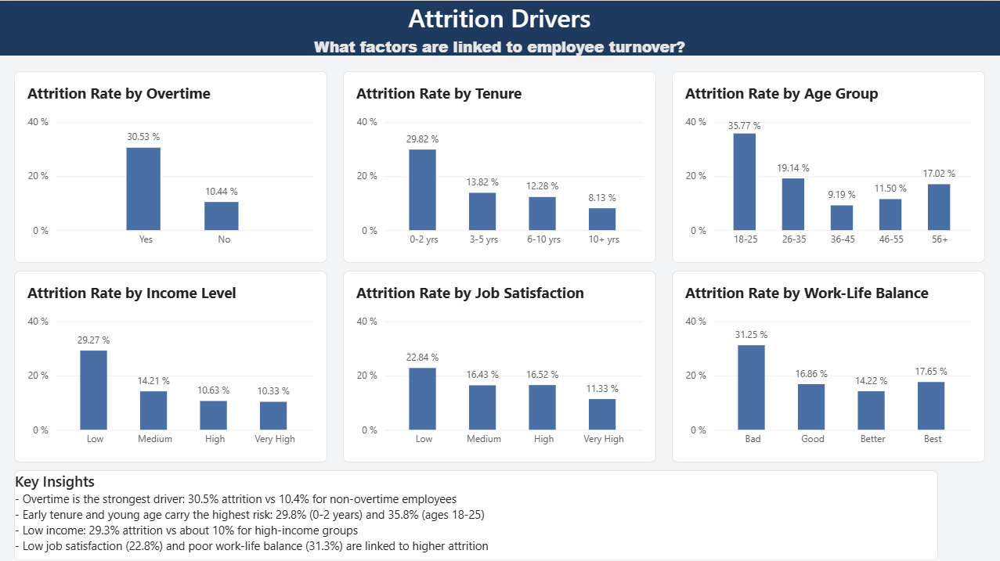
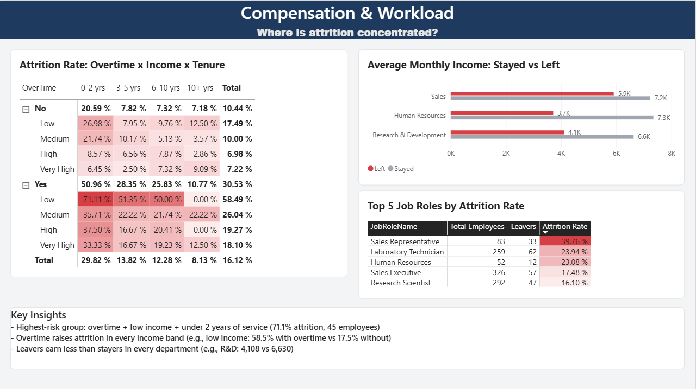

# HR Analytics: Employee Attrition Analysis

An end-to-end data analysis project that investigates **why employees leave** a company and where attrition is concentrated. The project covers data cleaning in Python, a relational database and analytical queries in SQL Server, and an interactive 3-page dashboard in Power BI.

## Business Problem

A company with 1,470 employees is losing staff, and management wants to understand:

1. What is the overall attrition rate?
2. Which departments and job roles are most affected?
3. Are overtime, income, tenure, age, satisfaction, or work-life balance linked to attrition?
4. Which employee groups are at the highest risk?
5. What actions could management consider?

## Dataset

- **Source:** IBM HR Analytics Employee Attrition & Performance dataset (publicly available on Kaggle)
- **Size:** 1,470 employees, 35 original columns
- **Quality:** no missing values and no duplicate rows
- **Attrition:** 237 employees left (16.12%), 1,233 stayed (83.88%)
- **Note:** the dataset has no attendance or absence data, so workload is analyzed through overtime, business travel, work-life balance, and satisfaction instead.

## Tools

| Stage | Tool |
|---|---|
| Data cleaning and EDA | Python (Pandas, Matplotlib, Seaborn) on Google Colab |
| Database and analysis | SQL Server, SSMS |
| Dashboard | Power BI (DAX measures, Power Query) |

## Methodology

1. **Data understanding:** reviewed structure, data types, missing values, duplicates, and class balance.
2. **Cleaning and feature engineering (Python):**
   - dropped constant columns (`EmployeeCount`, `StandardHours`, `Over18`)
   - dropped `DailyRate`, `HourlyRate`, and `MonthlyRate` after finding near-zero correlation with `MonthlyIncome`
   - converted numeric survey codes into readable labels
   - created `AttritionFlag`, `AgeGroup`, `TenureGroup`, and `IncomeBand`
3. **Database design (SQL Server):** loaded the cleaned file into a staging table and normalized it into six related tables: `Departments`, `JobRoles`, `Employees`, `Compensation`, `Surveys`, and `CareerHistory`.
4. **SQL analysis:** attrition by department, role, overtime, income, and promotion gap using `JOIN`, `GROUP BY`, CTEs, and window functions (`RANK`, `AVG() OVER`). A reporting view (`vw_HR_Full`) feeds Power BI.
5. **Exploratory analysis (Python):** visualized attrition against overtime, income, age, tenure, satisfaction, and work-life balance, plus a correlation heatmap.
6. **Dashboard (Power BI):** three pages with KPIs, slicers, conditional formatting, and a heat-map matrix.

## Dashboard

### Page 1: Overview


### Page 2: Attrition Drivers


### Page 3: Compensation & Workload


A PDF export is available in the `dashboard/` folder.

## Key Findings

- **Overall attrition is 16.1%** (237 of 1,470 employees).
- **Sales has the highest department attrition (20.6%)**, followed by Human Resources (19.1%) and Research & Development (13.8%).
- **Sales Representatives leave at 39.8%** (33 of 83), about 2.5x the company average. Laboratory Technicians follow at 23.9%.
- **Overtime is the strongest pattern:** 30.5% attrition for employees working overtime vs 10.4% for those who do not (about 3x).
- **Early tenure and young age carry the highest risk:** 29.8% attrition in the first two years and 35.8% for ages 18-25, dropping to 8.1% after 10 years of service.
- **Leavers earn less than stayers in every department** (for example, Research & Development: 4,108 vs 6,630 average monthly income).
- **Satisfaction and work-life balance:** attrition is 22.8% for low job satisfaction vs 11.3% for very high, and 31.3% for poor work-life balance.
- **Highest-risk group:** overtime + low income + under 2 years of service, with **71.1% attrition** (32 of 45 employees).
- **Overtime raises attrition within every income band:** for low-income employees, 58.5% with overtime vs 17.5% without.
- **Promotion gap showed no clear pattern**, so the initial hypothesis that long gaps without promotion drive attrition was not supported by this data.

## Recommendations

These suggestions are based on observed associations, not proven causes.

1. **Review overtime distribution**, especially for lower-income employees, where attrition is highest with overtime.
2. **Review workload and incentives for Sales Representatives,** the highest-risk role.
3. **Strengthen onboarding and follow-up in the first two years,** particularly for younger employees.
4. **Review pay in the lowest income band,** since leavers earn less than stayers across departments.
5. **Run regular satisfaction and work-life balance surveys** to detect problems early.

## Limitations

- Findings show **correlation, not causation.** For example, income is related to job level and tenure, so part of its effect may come from those factors.
- Some segments are small (for example, the Human Resources department has 63 employees and several matrix cells have fewer than 25), so their percentages are unstable.
- The dataset has no attendance data and does not specify currency, so income is shown without a currency.
- The dataset is a public sample and may not reflect a real organization.

## Repository Structure

```
hr-attrition-analysis/
├── README.md
├── data/
│   └── hr_clean.csv
├── sql/
│   ├── 01_create_tables.sql
│   ├── 02_analysis_queries.sql
│   └── 03_create_view.sql
├── notebooks/
│   └── data_cleaning_eda.ipynb
├── dashboard/
│   ├── HR_Attrition_Dashboard.pbix
│   └── HR_Attrition_Dashboard.pdf
└── images/
    ├── page1_overview.png
    ├── page2_drivers.png
    └── page3_compensation.png
```

## How to Reproduce

1. Run `notebooks/data_cleaning_eda.ipynb` on the original Kaggle file to produce `hr_clean.csv` (or use the file in `data/`).
2. In SQL Server, create a database named `HR_Analytics` and import `hr_clean.csv` into a staging table `hr_staging`.
3. Run the scripts in `sql/` in order.
4. Open `dashboard/HR_Attrition_Dashboard.pbix` in Power BI Desktop and point the data source to your SQL Server instance.

## Author

**Ibrahim Alrudayan**
Data Science graduate, University of Hail
[LinkedIn](https://linkedin.com/in/ibrahim-alrudayan) | [GitHub](https://github.com/ibrahimalrudayan)
